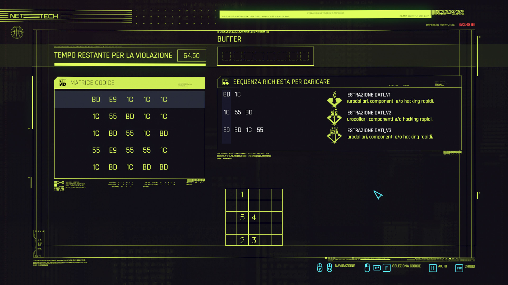

# CyberSolve: a rust solver for Cyberpunk 2077 puzzle game

NOTE: this project was developed as a mean of learning the Rust language, so it may still contain some bugs.

## Installing

Download the zip `cyber-solve-release.zip` from the releases, decompress the archive and run the `cyber-solve.exe` executable from the extracted folder.

## Usage

The tool will periodically scan for a puzzle to solve. If a complete solution is found, a square overlay grid will appear to tell how to solve as seen in the following image. The numbers will show which is the optimal cell order to solve the puzzle.



## How it works

This tool will periodically capture the screen and use image processing and recognition to detect the puzzle. As soon as a puzzle grid is detected, it will try to solve it to find a complete solution.

Libraries used:

- windows-rs: for the overlay window GUI
- opencv 4: for image detection and manipulation
- leptess: leptonica + tesseract OCR

## Build requirements

### Windows

Only the windows platform build is supported, since there are issues cross-compiling a `windows-gnu` target from other kinds of host OS.

``` sh
# Install llvm through chocolatey
choco install llvm

# Then use vcpkg for opencv and its deps
# tessless deps: install vcpkg, then from the vcpkg folder run
cd C:\src\win32\vcpkg


# [optional] To support freetype opencv module https://docs.opencv.org/4.5.3/d4/dfc/group__freetype.html install the following before installing opencv4
.\vcpkg install --triplet=x64-windows-static-md freetype harfbuzz
# then open the file .\vcpkg\ports\opencv4\portfile.cmake, and add a line with the option
# -DWITH_FREETYPE=ON
# inside of vcpkg_cmake_configure OPTION section

# Now, install opencv4
.\vcpkg install --triplet=x64-windows-static-md tesseract opencv4[contrib] # freetype 
```

### Debian/Ubuntu (untested)

```sh
# OpenCV deps
apt-get install libopencv-dev

# Install tessless deps
apt-get install libleptonica-dev libtesseract-dev clang tesseract-ocr libclang-dev
```

### Mac (untested)

```sh
# OpenCV deps
brew install opencv llvm pkg-config

# Install tessless deps
brew install tesseract leptonica
```

### Devcontainer cross build (from Mac M1 host)

```sh
# Install x86-64 compiler
apt install gcc-x86-64-linux-gnu
# Add rust windows x86_64 target
rustup target add x86_64-pc-windows-gnu
```

### Unbundled files to be downloaded

Manually download the following files:

- <https://github.com/tesseract-ocr/tessdata/blob/master/eng.traineddata> to
`assets/tesseract/eng.traineddata`

Dynamic library builds ONLY:  
to run the executable when using dynamic library builds, it is necessary to place a copy of the dll in the same folder of the executable to be run:
- `opencv_world4xx.dll`

The dll is not necessary with the default static linking build used by rust.

## Build release archive

```sh
./publish.sh
```

The release zip file containing the standalone binary executable will be created in `dist/cyber-solve-release.zip`
